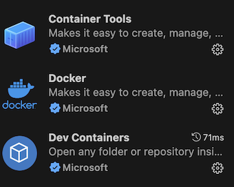
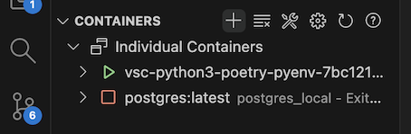
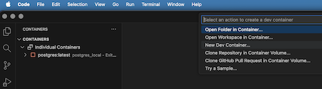
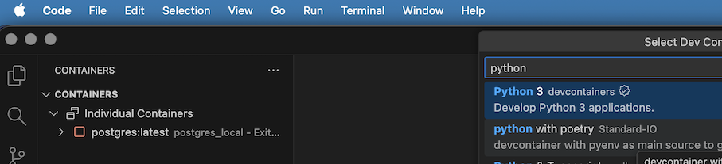
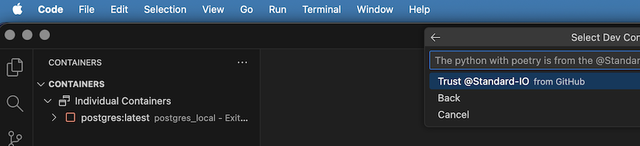
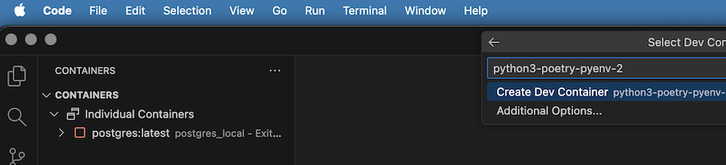

# Solsquad Bootcamp Exercise
The goal of this exercise is to create a new poetry script, based on the extract_all script in the main.py file. This new script will filter according to the ticket assigned to each participant. 

## Prerequisites
    - Docker
    - Visual Studio Code

## Installation

Install the Docker, Dev Containers and Container Tools extensions for Visual Studio Code

Select the Container's tab on the left of Visual Studio Code

Click on add(+) container

Select New Dev Container

Select python with poetry

Select Trust developer (Standard-IO)

Select Create Dev Container

